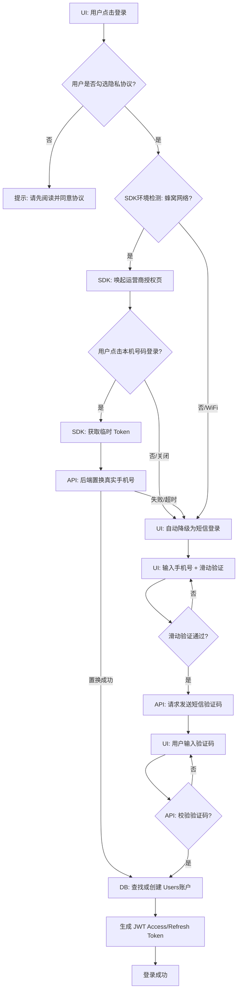

# Auth Workflows

## Login / Register Decision Tree



## Dual App Role Check

```mermaid
flowchart TD
  A[登录成功: 获得 UserID] --> B[DB: 查询用户现有 Roles]
  B --> D{当前 App 端?}

  %% 用户端逻辑 (C端)
  D -->|用户端 App| E{包含 ROLE_CLIENT?}
  E -->|是| G[放行: 生成用户端 Token]
  E -->|否 (新用户)| E1[Action: 自动赋予 ROLE_CLIENT]
  E1 --> G

  %% 商家端逻辑 (B端)
  D -->|商家端 App| F{包含 ROLE_MERCHANT?}
  F -->|是| I{商家资料审核状态?}

  I -->|已通过| J[放行: 生成商家端 Token]
  I -->|审核中| K[UI: 提示正在审核中]
  I -->|被拒绝| L[UI: 提示拒绝原因 & 重新提交]

  %% 商家端无权限处理
  F -->|否| M[UI: 跳转商家入驻申请页]
  M --> N[填写资料 & 提交审核]
```
